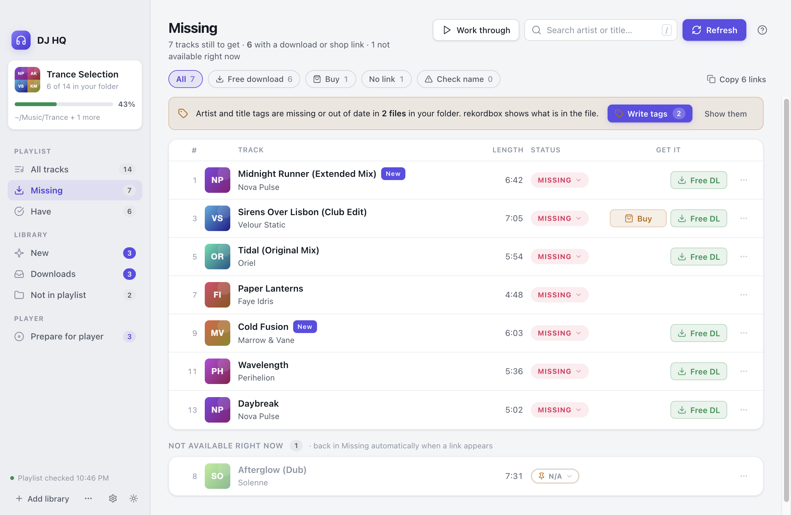
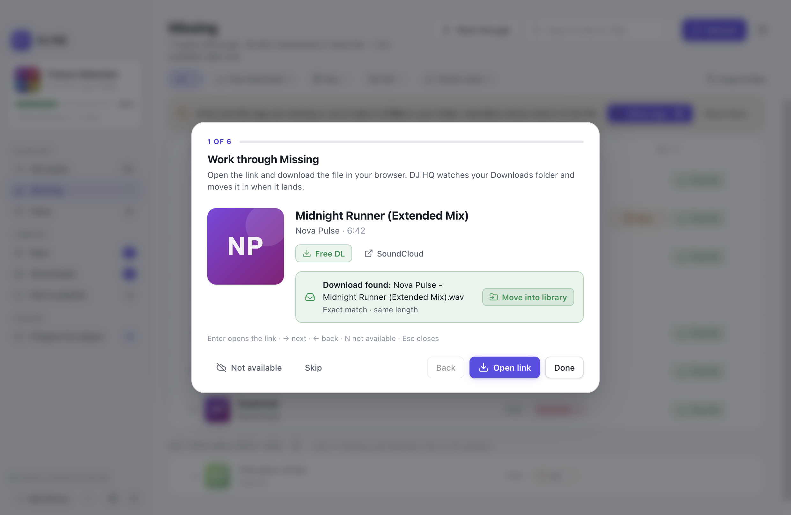
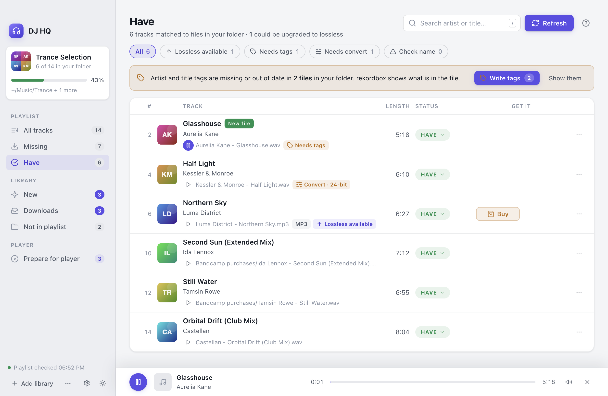
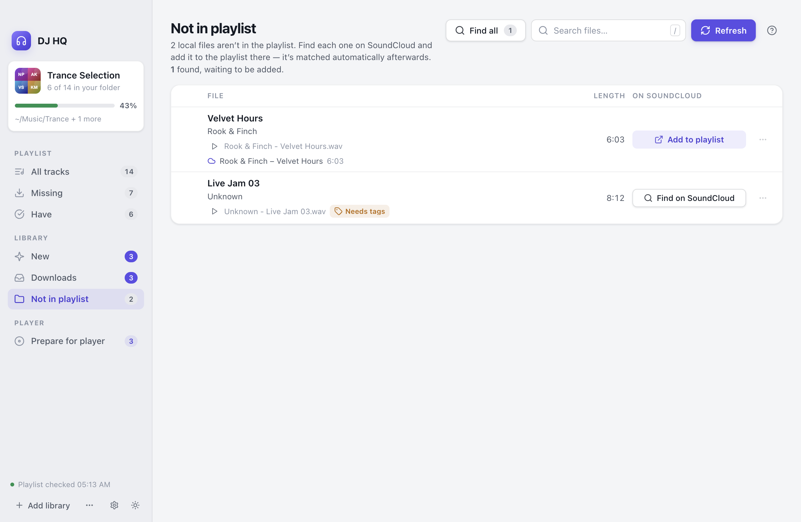
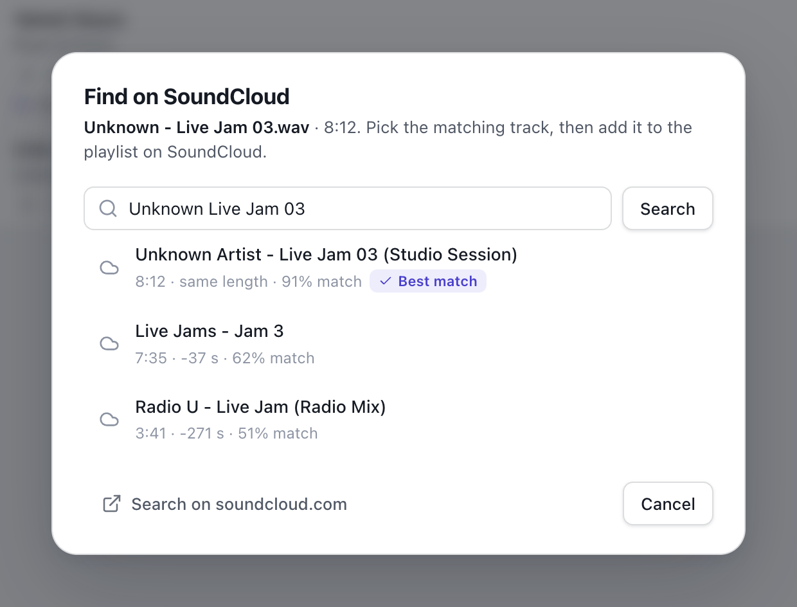
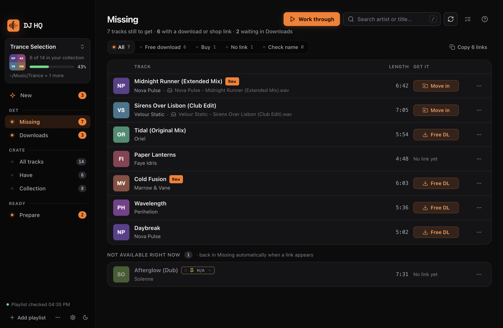
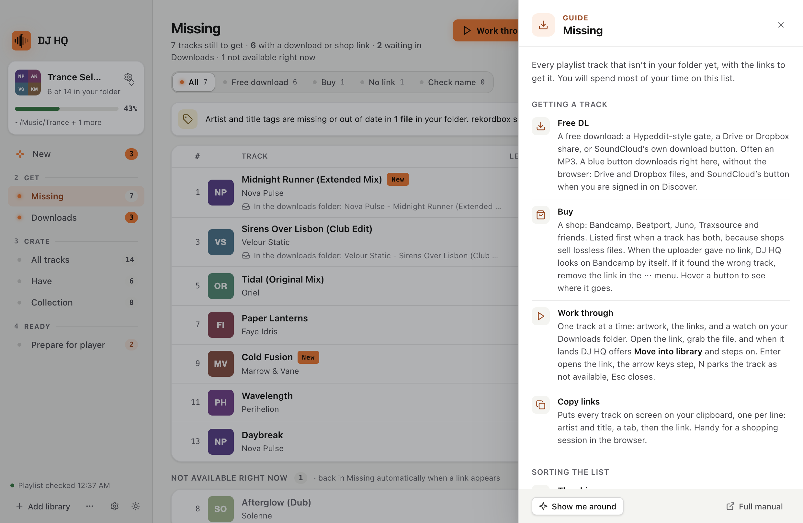

# DJ HQ

**Keep your music folder in sync with a SoundCloud playlist, and get your tracks ready for rekordbox and the club.**

**[Download page →](https://banneh.github.io/dj-hq-site/)** picks the right installer for your computer and walks you through the first start.



DJ HQ is a free desktop app for DJs who collect music through SoundCloud
playlists. It compares a playlist with the folder where your tracks live, shows
you what's still missing and where to get it, tidies up the files you have so
rekordbox and Pioneer players are happy, and hands you a rekordbox playlist when
you're done. SoundCloud itself lives inside the app on the **Discover** page,
so you can listen and add what you hear to the playlist with one click.
Everything runs on your computer; nothing is uploaded anywhere.

## Contents

- [What DJ HQ does](#what-dj-hq-does)
- [Install](#install)
  - [Download](#download)
  - [Opening the app for the first time](#opening-the-app-for-the-first-time)
  - [Updating](#updating)
- [Getting started](#getting-started)
- [Using DJ HQ](#using-dj-hq)
  - [Missing: tracks you still need](#missing-tracks-you-still-need)
  - [Have: tracks already in your folder](#have-tracks-already-in-your-folder)
  - [Discover: SoundCloud inside the app](#discover-soundcloud-inside-the-app)
  - [Your Likes](#your-likes)
  - [New: what changed since you last looked](#new-what-changed-since-you-last-looked)
  - [Downloads: moving new files into your library](#downloads-moving-new-files-into-your-library)
  - [Not in playlist: files SoundCloud doesn't know about](#not-in-playlist-files-soundcloud-doesnt-know-about)
  - [Prepare for player: tags, conversion and rekordbox](#prepare-for-player-tags-conversion-and-rekordbox)
  - [Do everything: Platinum Notes, Mixed In Key and rekordbox in one go](#do-everything-platinum-notes-mixed-in-key-and-rekordbox-in-one-go)
  - [Appearance, search and the sidebar](#appearance-search-and-the-sidebar)
  - [Settings](#settings)
  - [More than one folder](#more-than-one-folder)
  - [More than one playlist](#more-than-one-playlist)
  - [Moving to another computer, or a backup](#moving-to-another-computer-or-a-backup)
- [Tips and troubleshooting](#tips-and-troubleshooting)
- [Your files and your data](#your-files-and-your-data)
- [Technical details](#technical-details)
  - [Run from source](#run-from-source)
  - [Headless mode](#headless-mode)
  - [Project layout](#project-layout)
  - [HTTP API](#http-api)
  - [Releases](#releases)
  - [Out of scope](#out-of-scope)
- [License](#license)

## What DJ HQ does

A *library* in DJ HQ is a music folder (or several) linked to one SoundCloud
playlist: a public one, or a private one through its share link. The app fetches the playlist, scans the folders and works
out which file belongs to which track by comparing names and lengths.
Everything else builds on that:

- **Missing** lists every playlist track that isn't in your folder yet, with a
  **Free DL** or **Buy** button that takes you straight to the download gate or
  the shop. Links are found in the track's download button *and* in its
  description.
- **Have** shows the file behind each track you own, and flags anything that
  still needs tags, conversion, or could be upgraded from MP3 to lossless.
- **New** collects tracks added to the playlist and files that arrived in your
  folder since you last looked.
- **Downloads** watches your Downloads folder and moves new files into your
  library with one click, no renaming. Bandcamp zips are looked inside, and
  exact matches can move in on their own.
- **Not in playlist** finds the SoundCloud track for files that aren't in the
  playlist yet, so you can add them there.
- **Prepare for player** writes artist and title tags the way rekordbox reads
  them, converts files your Pioneer player can't play (in place, so your cues
  survive), and exports a rekordbox playlist.
- **Do everything** (optional, macOS and Windows) takes new downloads through
  the whole chain with one click: into the library, tags, Platinum Notes,
  Mixed In Key, and with their keys into your rekordbox XML.
- **Discover** is soundcloud.com inside the app: sign in there once, listen to
  what it suggests, and add or like what you hear with one click. Clicking a
  cover anywhere in DJ HQ plays the track there.
- **Your Likes** checks every track you liked on SoundCloud against your
  folders and shows what's still to get.
- Every file can be **previewed** in the app, and a library can follow your
  SoundCloud **Likes** instead of a playlist.

The playlist is checked again every 15 minutes while the window is open, and
whenever you press **Refresh**. DJ HQ writes to SoundCloud only when you ask it
to on Discover, signed in there as yourself; everything else reads what anyone
with the link can see and needs no login.

## Install

### Download

The easiest way is the [download page](https://banneh.github.io/dj-hq-site/):
it detects your computer and offers the matching file. Or get the latest build
from the [Releases page](https://github.com/Banneh/playlist-app/releases):

| Your computer | File to download |
| --- | --- |
| Mac with Apple Silicon (M1 or later) | `DJ-HQ-<version>-mac-arm64.dmg` |
| Mac with an Intel chip | `DJ-HQ-<version>-mac-x64.dmg` |
| Windows | `DJ-HQ-Setup-<version>.exe` |
| Linux | `DJ-HQ-<version>.AppImage` |

> [!TIP]
> Not sure which Mac you have? Click the Apple menu → **About This Mac**. If it
> says *Chip: Apple M…* you want the Apple Silicon file; if it says
> *Processor: Intel…* you want the Intel one.

There's nothing else to install; ffmpeg comes bundled.

### Opening the app for the first time

DJ HQ isn't signed with an Apple or Microsoft developer certificate (they cost
money), so your computer asks you to vouch for it once. No Terminal needed.

**macOS 15 (Sequoia) or newer**

1. Open the DMG, drag **DJ HQ** into **Applications**, then double-click it.
   macOS says it couldn't verify the app. Click **Done**.
2. Open **System Settings → Privacy & Security** and scroll down to the
   *Security* section. Next to "DJ HQ was blocked", click **Open Anyway**.
3. Confirm with your password or Touch ID. From then on it opens like any
   other app.

**macOS 14 (Sonoma) or older**

Right-click (or Control-click) **DJ HQ** in Applications, choose **Open**,
then click **Open** in the dialog. Once is enough.

**Windows**

SmartScreen says it protected your PC. Click **More info**, then
**Run anyway**.

### Updating

DJ HQ looks for a newer version on GitHub once a day. When there is one, a
small notice appears at the bottom of the sidebar with a **Download** button
for your computer. Install the new version over the old one; your library and
settings stay where they are. **⋯ → Check for updates…** checks right away.

## Getting started


1. Click **Browse…** and pick the folder where your tracks live (or type the
   path).
2. Paste the link to your SoundCloud playlist. A public playlist's address
   works as it is. For a private playlist, open **Share** on it on SoundCloud
   and paste that link (it ends in `/s-` and a code); anyone with the link can
   see the playlist, so keep it to yourself. If you collect by liking tracks
   instead, paste your Likes page (`https://soundcloud.com/you/likes`); it
   works the same way.
3. Click **Connect library**.

DJ HQ fetches the playlist, scans the folder and matches files to tracks. That
takes a few seconds for a few hundred tracks. If SoundCloud won't hand out some
of the tracks (deleted, blocked in your country, or private and not shared
with the link), the status line says how many could not be read.

To point a library at another link later, for example after making its playlist
private, use **Settings → Change link…**. The new link is fetched first; your
matches, edits and "new" marks stay, and the old link is kept if the new one
can't be read. If the new link misses tracks the library has (another playlist,
or tracks it can't read), DJ HQ says how many and asks before it changes
anything, since those tracks leave the library with their matches.


The first time, a **Before we start** screen asks for the basics: which folder
your downloads land in and whether exact matches may be moved into the library
on their own, which player you play on, whether the folders inside your music
folder count too, and light or dark. Every one of them has a sensible default,
so **Let's go** is a fine answer; all of it lives in Settings afterwards.

You land on the **Missing** list, and the sidebar shows how much of the
playlist is already in your folder.

The first time, DJ HQ offers a one-minute tour that points out what each list
is for. It runs on a few sample tracks, so you can take it before connecting
anything (there's a button for it on the welcome screen) and nothing in your
own library changes. Click **Not now** to skip it; **⋯ → Show me around**
replays it any time.


> [!NOTE]
> Nothing is renamed, moved or rewritten at this point. DJ HQ only reads your
> folder until you ask it to write tags, convert a file or move a download.

## Using DJ HQ

### Missing: tracks you still need

This is the list you'll spend the most time in: every track from the playlist
that isn't in your folder, with the quickest way to get it.

- **Free DL** is a free download: a Hypeddit-style gate, a Drive or Dropbox
  share, or SoundCloud's own download button.
- **Buy** is a shop: Bandcamp, Beatport, Juno, Traxsource and friends. When a
  track has both, Buy comes first, because shops sell lossless files and free
  downloads are often MP3s. Hover a button to see where it goes.

**To work through the list**

1. Use the chips above the list to narrow it down: tracks with a free download,
   with a shop link, or with no link at all.
2. Click **Free DL** or **Buy**. The link opens in your browser; the file ends
   up in your Downloads folder as usual.
3. Switch to **Downloads** in the sidebar once a few files have landed, and
   move them into your library from there (see below).

**Working through a long list**



**Work through** (top right) takes the list one track at a time: artwork, the
links, and a watch on your Downloads folder. Open the link, grab the file in
your browser, and when it lands DJ HQ offers **Move into library** and steps to
the next track. Enter opens the link, the arrow keys step, N parks a track as
not available, Esc closes.

**Other things you can do here**

- **Copy links** puts every track on screen on your clipboard as
  "Artist – Title, link", one per line. Handy for a shopping session.
- Click a track's status pill to change it by hand. **Not available on
  SoundCloud now** parks a track in a quiet section at the bottom; it comes
  back on its own the moment a link appears for it. **Back to automatic**
  undoes any manual status.
- The **⋯** at the end of a row opens the track on SoundCloud, copies its
  links, matches a file by hand, or lets you fix the artist and title.
- Click the artwork to open the track on SoundCloud.

<p align="center"></p>

### Have: tracks already in your folder


Each track shows the file it was matched to, plus a small tag when something
needs attention:

| Tag | Meaning |
| --- | --- |
| **Needs tags** | Artist and title in the file are missing or differ from the name shown, for example after you swapped or edited it. |
| **Convert · 24-bit** (or 88.2 kHz, …) | The selected player can't play this file as it is. |
| **MP3** | A lossy file. |
| **Lossless available** | You have the MP3, and the shop link sells a lossless version. |
| **Matched by hand** | You picked this file yourself. |
| **Check name** | Artist and title may be the wrong way round, or split in the wrong place. Shown on every list, also for tracks you don't have yet. |

The **Needs tags**, **Needs convert** and **Lossless available** chips above
the list show only those tracks, and the counts on the Prepare for player cards
open the same chips. While any file still needs tags, a notice above the
playlist lists how many and offers **Write tags** right there, so you don't
have to go to Prepare for player for that. A file that needs the same work but
isn't in the playlist is mentioned under the list, with a link to Not in
playlist.

The small play button in front of a file name previews it right in the app; a
player bar appears at the bottom with a seek line you can click or drag, and
mute. It is the same bar that shows a track playing on SoundCloud, so there is
only ever one player. The same button sits in
the match dialog, so you can check a shaky match by ear.



**To fix a wrong match**

1. Click the file name under the track, or choose **⋯ → Match to a local
   file…**.
2. Pick the right file. Likely candidates are listed first; files already
   matched to another track are marked, and picking one frees that track to
   match again.
3. Choose **No file** if the track isn't in your folder at all, or
   **Auto-match** to let DJ HQ decide again.

<p align="center"></p>

### Discover: SoundCloud inside the app

**Discover** is soundcloud.com inside DJ HQ. Sign in there once, the way you
would in a browser (the session is SoundCloud's own and stays on this
computer), listen to whatever it suggests, and add what you like to the
playlist from the bar above the page, without a popup for every track.

The bar shows the track SoundCloud's player is playing, with its cover, its
length and whether it's in the playlist already:

- **Add to playlist** puts it into the playlist on SoundCloud, so it lands in
  Missing right away. For a library that follows your Likes, Add likes the
  track instead.
- The **heart** likes or unlikes it. With **Also like tracks you add to the
  playlist** turned on in Settings, adding likes it as well, so your Likes keep
  a record of everything you picked.
- **Related tracks** opens what SoundCloud suggests after it. **Back**,
  **Home** and **Playlist** step around the site.

The bar's player listens to the keyboard as well, whether you last clicked the
bar or the SoundCloud page (as long as you aren't typing in a field):

| Key | Does |
| --- | --- |
| `Space` | play / pause |
| `←` `→` | 10 seconds back / forward |
| `N` `P` | next / previous track in SoundCloud's queue |
| `A` | add the playing track to the playlist (to your Likes for a Likes library) |
| `L` | like / unlike it |

Discover's player also serves the rest of the app. Click a track's cover on
any list and it starts playing on SoundCloud while you stay on the list; a bar
at the bottom of the window shows the track with play/pause, previous and
next, the heart and **Add to playlist**, and its **Discover** button opens the
page the track is on. The same keys work there. Leaving Discover while
something plays keeps it playing, and the bar takes over; its **×** pauses and
hides it. The **⋯** menu of a row offers **Play**, **Open on Discover** and
**Related tracks on Discover** as well. A small arrow that appears next to the
title on hover opens the track in your browser instead. Prefer the browser for
everything? Switch **Opening tracks** in Settings, and the arrow becomes a
play button for SoundCloud inside the app.

While you're signed in, **Add to playlist** on Not in playlist is one click
too, instead of a trip to the site. **Sign out…** in Settings forgets the
session.

Now and then SoundCloud's bot protection asks you to prove you're human and
shows a check (a captcha) on the page. Until it is solved, nothing that goes
through Discover works: tracks don't start from your lists, and Add and the
heart fail. DJ HQ notices it and puts a note on top of every other page with
an **Open Discover** button; solve the check there and the note goes away by
itself. Meanwhile those actions say so at once instead of waiting.

Discover needs the desktop app. In a browser tab (headless mode) the page says
so, and you use soundcloud.com next to DJ HQ instead.

### Your Likes

Every track the signed-in SoundCloud account has liked, checked against the
files in all your libraries. **Still to get** lists the liked tracks that are
in none of your folders, with the same Free DL and Buy links as Missing. **In
your folders** are the ones you already have, through the playlist, a found
file, or a file with the same name and length in any library. **Not in the
playlist** are those missing from the active playlist, each with an **Add**
button. The list is cached for a few minutes; **Refresh** reads it from
SoundCloud again. A library that follows your Likes is this list by
definition, so Add is hidden there.

### New: what changed since you last looked


Tracks added to the playlist (**New**) and files that arrived in your folder
(**New file**) collect here until you press **Mark all as seen**. Treat it as
the to-do list for tagging, converting and importing into rekordbox. When a
refresh finds changes, a short notice tells you how many tracks were added or
removed.

### Downloads: moving new files into your library


DJ HQ keeps an eye on your Downloads folder. Audio files there are compared
with the playlist the same way your library is, and the ones that match a track
show up here.

1. Check the row: it shows which track the file belongs to, whether the length
   matches, and whether it's an MP3.
2. Click **Move into library**. The file is moved as it is, no renaming, and
   linked to the track. It disappears from Missing and appears in Have.
3. For a lossless download of a track you only had as an MP3, the button reads
   **Upgrade**. The old MP3 goes to the backup folder, not the bin.
4. **Move all** does the whole list at once, after telling you how many files
   are upgrades.

Audio that matches no track in the playlist is listed below, under **Not in
the playlist**. **Move** puts such a file into your library as it is, where
Not in playlist picks it up. **Find on SoundCloud** searches for the track
first: pick the right candidate and the file moves in matched to it, and, with
the box ticked (signed in on Discover), the track goes into the playlist on
SoundCloud in the same step, so it lands in Have right away. A candidate that
is already in the playlist simply becomes the file for that track.

Bandcamp purchases arrive as zips; DJ HQ looks inside them, lists the tracks
that belong to the playlist (tagged "from Album.zip") and unpacks only those,
leaving the zip where it is. Unfinished downloads are ignored; let them finish,
then click **Rescan**. Files that are already in your library by name are
counted but not listed.

With **Move exact matches automatically** turned on in Settings, a download
whose name and length match a track exactly moves into the library on its own
within a minute, and the app tells you. Fuzzy matches and upgrades always wait
for your click.

With [Do everything](#do-everything-platinum-notes-mixed-in-key-and-rekordbox-in-one-go)
switched on, its button sits next to **Rescan**: it moves these files in and
takes them on through tags, Platinum Notes, Mixed In Key and your rekordbox XML.

### Not in playlist: files SoundCloud doesn't know about



Tracks in your folder that match nothing in the playlist. The idea is to get
them *into* the playlist, so the playlist stays the one list that's always
right.

1. Click **Find all** to search SoundCloud for every file at once. Sure matches
   are accepted automatically; the rest are left for you.
2. For those, click **Find on SoundCloud**. Candidates are listed with their
   length and how well they match; a candidate already in the playlist is
   marked, and picking it links the file to that track. If nothing fits, edit
   the search text: shorter works better, so drop the remix part.
3. Pick a candidate. The row now shows the found track and an **Add to
   playlist** button, which opens it on SoundCloud so you can add it to the
   playlist yourself.
4. On the next refresh the file is matched to its track automatically and
   leaves this list.

<p align="center"></p>

If a file's artist or title is wrong (DJ HQ reads them from the file name),
click **⋯ → Edit artist / title** first; the search and the tags use your
values.

### Prepare for player: tags, conversion and rekordbox


1. **Pick your player** at the top. Everything below adapts to what it can
   play: the XDJ-700 and XDJ-1000 only take 16-bit WAV at 44.1 or 48 kHz, while
   the CDJ-2000NXS2, XDJ-XZ and CDJ-3000 also play 24-bit, 96 kHz and FLAC.
2. **Write tags** writes the artist and title into every file where they are
   missing or differ from the names DJ HQ shows, in the way rekordbox actually
   reads them (it's picky about WAVs). The genre becomes the playlist name.
   Everything else in the file's tags stays:
   the key and energy from Mixed In Key, comments, cover art and the mark
   Platinum Notes leaves on files it has processed. The key shows next to the
   file name and goes into the rekordbox export.

   Artist and title come from the SoundCloud title: artist before the dash,
   title after it. "Premiere:", a catalogue number or vinyl side in front, and
   "Free DL" in any spelling are left out, and an en dash counts as a dash.
   When the uploader's name (or SoundCloud's artist field) is on the right of
   the dash, the two are swapped. A remix keeps the original artist; the
   remixer stays in the title. When nothing confirms the order, the track gets
   a **Check name** tag, and **Check names** on the Tags card walks through
   those names one at a time: **Keep** (Enter), **Swap** (S), **Edit** (E),
   skip or go back with the arrow keys. Switch to **All names** to go through
   the whole library. Your choices are kept and win over what DJ HQ reads;
   **Write tags** then puts them into the files. **⋯ → Swap artist and title**
   on a row does the same for one track.
3. **Convert** turns files your player can't play into ones it can, in place:
   same file name, same length, so rekordbox keeps your hot cues and beat
   grids. The originals are backed up first, and **Restore originals** puts
   them back whenever you like.
4. **Export XML…** writes a rekordbox playlist with every matched file and
   shows you how to import it. In rekordbox: *Preferences → Advanced →
   Database → rekordbox xml*, browse to the file once; a *rekordbox xml* item
   then appears in the tree, and right-clicking the playlist there offers
   **Import Playlist**. Tracks already in your collection keep their cues and
   grids. Export again whenever the playlist changes; the file path stays the
   same.

<p align="center"></p>

The **Files needing attention** list underneath shows exactly which files still
need tags or conversion before they're ready for the booth, each with its
artwork and a play button.

### Do everything: Platinum Notes, Mixed In Key and rekordbox in one go

If you run new tracks through [Platinum Notes](https://mixedinkey.com/platinum-notes/)
and [Mixed In Key](https://mixedinkey.com/) before they go into rekordbox, one
button can do the whole round:

1. **Move** the matched downloads into the library: exactly what **Move all**
   on Downloads would move, never the files that match nothing.
2. **Write tags** where they differ from the names in DJ HQ.
3. **Platinum Notes** opens with the files. You press **Start Processing**
   there (or DJ HQ presses it for you, see below); DJ HQ notices by itself when
   Platinum Notes has finished: every processed file carries Platinum Notes'
   mark, and its run log says the run is over.
4. **Mixed In Key** opens with the files in the background and writes their
   keys into them; DJ HQ goes on as soon as every file has a key tag. A file
   that has a key already isn't sent (for FLAC and M4A, which carry no key tag
   DJ HQ can read: a key in Mixed In Key's database counts). Mixed In Key leaves a WAV that Platinum Notes
   processed with only its own tags (the file name as title, the key), so DJ HQ
   writes the artist, title and genre again afterwards; the key, Mixed In Key's
   data and Platinum Notes' mark stay.
5. The tracks go **into your rekordbox XML** with their keys, in a playlist
   called "DJ HQ". rekordbox analyses the rest (beat grid, waveform) itself.
   No cue points are taken from Mixed In Key, and nothing is converted.

Then a report: what went where, files that failed and why, names worth a look,
files without a key, and the three steps left to do in rekordbox.

**What it needs.** Platinum Notes and Mixed In Key installed on this computer,
Platinum Notes set to **Replace original files**, and the rekordbox XML file
rekordbox imports from. Mixed In Key's database is optional: DJ HQ reads it
(never writes it) only for a file that comes out of Mixed In Key without a key
tag. The key otherwise comes from the file's own tags.

**Setting it up.** Settings → **Do everything**: switch it on and press
**Configure…**. The setup looks for everything on this computer and asks for
the rest, one step at a time, each with a *How do I find it?*:

- On a Mac the apps are in Applications, as "Platinum Notes 10" and "Mixed In
  Key 11" (the number is the version). Mixed In Key's database is
  `~/Library/Application Support/Mixedinkey/Collection11.mikdb`.
- On Windows they are usually in your user's
  `AppData\Local\Programs\Mixed In Key` folder, as `Platinum Notes.exe` and
  `MixedInKey.exe`. Type `%LOCALAPPDATA%\Programs` into the file window's
  address bar, or use *Open file location* on the Start menu entry. Mixed In
  Key's Windows database can't be read for keys yet, so that step is skipped.
- **Platinum Notes' output.** In Platinum Notes: the *Personalise* menu →
  *Output Location* → **Replace original files**. The processed file then
  takes the original's place, so your library, the tags and rekordbox keep
  pointing at the same file; Platinum Notes copies every original to its
  backup folder first (on a Mac usually `~/Music/PN Backup`). Any other mode
  writes copies elsewhere, and Do everything doesn't start. On Windows DJ HQ
  can't read this setting, so you confirm it yourself.
- **The rekordbox XML** must be the file set in rekordbox under *Preferences →
  Advanced → Database → rekordbox xml* (Imported Library); setup suggests the
  one rekordbox and Mixed In Key already use. No file yet? In rekordbox, *File
  → Export Collection in xml format*, then set it there. DJ HQ saves a backup
  next to it (`rekordbox.xml.backup-<date>-<time>`) before every change and
  leaves everything else in it byte for byte as it was.

Finishing the setup switches the feature on. Until everything is in place the
button is greyed out with what's missing written next to it, and
**Configure…** beside it.

**What stays manual.** Pressing **Start Processing** in Platinum Notes,
unless you switch on **Press Start Processing in Platinum Notes for me** (Settings
→ Do everything, or the last step of Configure…, macOS only). DJ HQ then brings
Platinum Notes to the front and presses that one button, and only once every
file shows in its list; it never presses anything else. That needs DJ HQ in
*System Settings → Privacy & Security → Accessibility*, and the first time
macOS also asks whether DJ HQ may control *System Events*: the setting shows
whether it is allowed, with an **Allow…** button (once allowed, **Check again**
asks macOS for real, which shows the System Events question if it hasn't been
answered yet). If the button can't be pressed (no permission, or Platinum Notes
has no window because the screen was locked) you press it yourself, exactly as
without the setting; the run says why. When a press starts no run within 15
seconds (a message in Platinum Notes, say), the run asks you to look at Platinum
Notes and DJ HQ doesn't press again. Cancel, Skip and Mark as done stop a press
that hasn't clicked yet. Because DJ HQ is ad-hoc
signed (not with a paid Apple certificate), macOS may forget the Accessibility
permission after an update: if it says "not allowed" again, switch DJ HQ off
and on in that list.

DJ HQ notices by itself when each app has finished, so there is normally nothing
to press in DJ HQ. **Mark as done** (go on at once) and **Skip this step** (go on
without it) are there for the odd case; no wait has a time limit. An app DJ HQ
opened is closed again after its step (a switch in Settings), and DJ HQ checks
that it really is gone. Platinum Notes is only asked to close once its run is
over: asked earlier, it would put up a "still processing, really quit?" dialog,
so after **Mark as done** in the middle of a run it is left open. An app that was
already open is left alone; anything left open is in the report.

The run goes on when its window is closed: the button shows it (*Waiting for
Platinum Notes*) and opens it again. **Cancel** stops between two files, so
none is left half-moved or half-tagged. If DJ HQ is closed during a run, the
run comes back as interrupted, to resume or clear.

**Afterwards, in rekordbox:**

1. *Preferences → Analysis → Track Analysis Setting*: untick **KEY**, so
   rekordbox keeps these keys instead of replacing them with its own.
2. Click the refresh icon next to *rekordbox xml* in the sidebar.
3. Open *rekordbox xml → Playlists → DJ HQ*, select all its tracks, right-click
   and choose **Import To Collection**.

**Limits.** Platinum Notes must replace the original files. Tested with
Platinum Notes 10.5 and Mixed In Key 11.2.6 on macOS; still untested: rekordbox
importing the merged XML (Tonality included), the whole Windows side (finding the
apps, handing them files, closing them), and the packaged app's own
Accessibility and System Events permissions for **Press Start for me** (tested
from a Terminal that had them). The live runs used WAV and MP3 files only: M4A,
AIFF and FLAC, Platinum Notes already open or showing a dialog at launch, its
replace confirmation, and Mixed In Key with many files or one it can't analyse
are untested; where a wait doesn't end by itself, **Mark as done** goes on.
An M4A that Platinum Notes leaves untouched is reported as left as it is (most
likely processed before), since DJ HQ can't read its mark in that format.
Platinum Notes keeps its backups in one flat
folder, so two originals with the same file name from different folders
overwrite each other's backup there.

### Appearance, search and the sidebar





- The sun-and-moon button at the bottom of the sidebar switches between light,
  dark and "follow the system".
- The search box filters the current list by artist, title or file name. Press
  `/` to jump to it.
- The **?** button in the top right opens the Guide for the page you're on: what
  every row, tag, button and chip means and what to do with it, in more detail
  than the tour. Press `?` for the same thing.
- The library card at the top of the sidebar shows how many playlist tracks are
  in your folder; the counts next to each list are live. **All tracks** is the
  whole playlist, **Missing** and **Have** split it.
- The **⋯** button at the bottom of the sidebar opens the playlist on
  SoundCloud, rescans the music folder, exports the rekordbox XML, replays the
  tour, checks for updates, and adds or removes libraries. The gear next to it
  opens Settings.

### Settings


The gear at the bottom of the sidebar. From top to bottom: the library (its
folders, playlist, remove), the SoundCloud account signed in on Discover (sign
out, and the switch that likes every track you add), where tracks open
(Discover or your browser), the Downloads folder DJ HQ watches and the switch
for moving exact matches automatically, Do everything (the switch, the apps
and files it uses with their state, closing the apps after their step, and
**Configure…**), how often the playlist is checked,
appearance, backups (how much space the originals of converted files and
replaced MP3s take, with a **Clean up** button once you're sure you won't need
them), moving or backing up your setup (**Export configuration…** and
**Import configuration…**), and updates.

### More than one folder

A library starts with one folder, but your tracks for a playlist may be spread
over several, or sorted into subfolders. Both work:

- **Add folder** in the library card of Settings adds another folder to the
  library. Files in any of its folders count as yours. The first folder stays
  the *main* one: that is where downloads are moved into. A folder can be
  removed from the library again; its files stay where they are.
- **Include subfolders** also scans the folders inside each library folder.
  It is off unless you turn it on, so a library never picks up more than you
  asked for.

Files outside the main folder are listed with their folder in front, for
example `Deep/Artist – Title.wav` or `Vinyl rips/Artist – Title.wav`, so you
can see where each one lives. Tags, conversion, backups and restore work on
them like on any other file.

### More than one playlist

Click **+ Add library** in the sidebar to link another folder to another
playlist, and switch between libraries from the library name at the top. Each
library keeps its own matches, edits and "new" marks.

### Moving to another computer, or a backup

**Settings → Move or back up your setup → Export configuration…** saves one
file, `DJ HQ config <date>.djhq.json`, with everything DJ HQ knows about your
libraries: each library's SoundCloud link and track list, its matches (by hand
and automatic), the names you edited, Have / Missing / not available marks,
what's new, and your settings (refresh interval, auto-move, appearance, the
target player). Save it on a USB stick or in a cloud folder (a cloud folder is
just a folder on disk here), and import it on the other computer, on the
Windows PC, or on this one again as a backup.

Not in the file: the music itself, the backed-up originals (so *Restore
originals* has nothing to restore on the new computer), the SoundCloud
sign-in, and this computer's paths: the Downloads folder and the Do everything
setup are looked up again there (Settings → Do everything → **Configure…**).
Files are recorded by their name inside the library folder, never by a full
path, so a Mac file imports on Windows and the other way round.

A private playlist's share link works like a password. When a library uses
one, the export says so and offers **Leave the links out**; the library then
arrives without its link, says so on every page, and isn't checked for
changes until you paste the link again with **Change link…**. Everything else
works from the track list in the file.

**Import configuration…** (also on the welcome screen of a fresh install)
goes in steps, and nothing changes before the last one:

1. Choose the file. DJ HQ reads and checks it; a file from a newer DJ HQ, a
   damaged or cut-off file, or one with file names pointing outside the
   library folder is refused.
2. What's in it: per library the tracks, matches (by hand and found by DJ HQ),
   edited names and marks, and what the import replaces on this computer.
3. Music folders: for each library folder, the folder on this computer
   (Browse… or type it). DJ HQ counts how many of the library's files it finds
   there before anything is changed. Files are found by their name, also when
   the copy changed upper and lower case or the way accented letters are
   stored, and by a file name that appears once anywhere in the folder (then
   *Include subfolders* is switched on). A name that appears twice is left
   unmatched rather than guessed.
4. Confirm. Matches whose file isn't in the folder are dropped. When none of a
   library's files are there yet (a fresh computer, music not copied yet), you
   can still import it: the library then waits for its files, keeps every
   match and points it at each file as it arrives, until you press **The copy
   is complete**. Nothing shows as a new file that wasn't new before.

An import replaces the libraries on this computer (adding one next to existing
ones comes later). Before it writes anything it saves the current `state.json`
and `prefs.json` in `backups/` in the data folder (the last five imports, and
every import of the past week, are kept); to go back, quit DJ HQ and copy the
backup over `state.json`.

## Tips and troubleshooting

- **A match is wrong.** Click the file name under the track and pick the right
  file, or choose *No file*. The status pill lets you set Have or Missing by
  hand.
- **No Free DL or Buy button on a track.** The uploader set no purchase link
  and wrote none in the description. The **⋯** menu still opens the track on
  SoundCloud.
- **Find on SoundCloud finds nothing.** Try shorter search text and drop the
  remix part. Some edits simply aren't on SoundCloud; **⋯ → Search on
  soundcloud.com** opens the site's own search.
- **Clicking a cover opens Discover but nothing plays.** SoundCloud asks for a
  sign-in before it plays anything. Sign in once on the Discover page; the
  session is kept.
- **"SoundCloud wants to check you are human".** SoundCloud's bot protection
  put a check (a captcha) on the Discover page. Open Discover, solve it, and
  playing, Add and the heart work again.
- **A download doesn't show up.** Zips and unfinished downloads are ignored:
  unzip, let it finish, then **Rescan**. A file whose name already exists in
  your folder counts as "already in your library".
- **rekordbox still shows the old bit depth after converting.** That column is
  cached. Right-click the track → *Analyze Track* (hot cues survive), or just
  ignore it; playback uses the real file.
- **Tags don't show for tracks already in rekordbox.** Select them →
  right-click → *Reload Tag*.
- **The XML playlist imported but the tracks look unchanged.** A rekordbox
  quirk: importing a playlist doesn't update tracks already in the collection.
  Right-click the tracks inside the *rekordbox xml* node and import those too.
- **Do everything waits for Platinum Notes, but nothing happens there.** Its
  window may not have come up (macOS doesn't let an app come to the front while
  the screen is locked): click Platinum Notes in the Dock, then press **Start
  Processing**. If Platinum Notes made `_PN` copies instead of replacing the
  files, it isn't set to *Replace original files*; check the setting in
  Configure. **Mark as done** goes on regardless.
- **"Press Start for me" doesn't press it.** Settings → Do everything shows
  whether macOS allows it; **Allow…** opens the right list in System Settings,
  and **Check again** asks macOS for real (it may ask about System Events once).
  After an update of DJ HQ, switch it off and on again there.
- **Do everything's tracks don't show in rekordbox.** The XML in Configure must
  be the one under *Preferences → Advanced → Database → rekordbox xml*; then
  refresh *rekordbox xml* and import the *DJ HQ* playlist's tracks.
- **"Couldn't load your library: operation not permitted" (macOS).** Give the
  app access to your music folder in System Settings → Privacy & Security →
  Files and Folders.
- **macOS says the app is "damaged" and should go in the Bin.** That happens
  when a download tool strips the app's signature. Download the DMG again with
  Safari or Chrome. If it still says damaged, the one-time Terminal fix is
  `xattr -cr "/Applications/DJ HQ.app"`.

## Your files and your data

**DJ HQ is careful with your files.** Tag writes copy the audio bit for bit and
verify it before replacing the file; on any doubt the original stays untouched.
Conversions back up the original first and verify the length afterwards, and
backups are never deleted. Moving a download is a real move, not a
copy-and-forget. Do everything is the one place where another app rewrites
your audio: Platinum Notes replaces each file with its processed version and
keeps the original in its own backup folder. Your rekordbox XML (wherever you
keep it) gets a timestamped backup next to it before every change. Keep your
own backups anyway: it's your library.

**Where things live.** The app keeps its data in the OS user-data folder,
`~/Library/Application Support/DJ HQ` on macOS and `%APPDATA%\DJ HQ` on
Windows. Running from source uses the project folder instead. In there:

| | |
| --- | --- |
| `state.json` | libraries, playlist snapshots, manual matches, edits, "new" marks |
| `originals/<library>/` | originals backed up before a conversion |
| `originals/<library>/replaced/` | MP3s replaced by a lossless download |
| `rekordbox.xml` | the last rekordbox export |
| `prefs.json` | appearance, "tour seen", dismissed update notices |
| `pipeline.json` | the current or last Do everything run, so it survives a restart |
| `backups/` | `state.json` and `prefs.json` as they were before each configuration import (the last five) |
| `Partitions/` | the SoundCloud sign-in session behind Discover (Settings → Sign out clears it) |

`state.json` is replaced in one step on every save, so a crash never leaves
half a file. If it can't be read at launch, DJ HQ moves it aside as
`state.json.unreadable-<time>`, starts fresh and says so, rather than saving
over it. When a library folder isn't there (an unplugged drive, a cloud folder
that hasn't synced, a renamed folder), the app says so and forgets nothing:
manual matches and "new" marks come back with the folder.

**About SoundCloud.** There's no API key: the app reads the same public
endpoints the SoundCloud web player uses. That works today and may break
whenever SoundCloud changes their site. Public playlists work, and private ones
through their share link, which DJ HQ keeps in `state.json`. The app
writes to SoundCloud only from Discover, where you are signed in as yourself,
and only when you add, remove or like a track (it won't change a playlist it
can't see in full, since saving would drop the tracks it can't see); DJ HQ never sees your password,
since the sign-in happens on soundcloud.com inside the app. The playlist is
fetched on launch, every 15 minutes while the window is open, and when you
press Refresh; a track search runs only when you use Find on SoundCloud or
Find all.

## Technical details

### Run from source

Needs [Node.js](https://nodejs.org) 20 or newer.

```
git clone https://github.com/Banneh/playlist-app.git
cd playlist-app
npm install
npm start
```

### Headless mode

The same interface in your browser, without the Electron window:

```
npm run headless        # then open http://localhost:8765
```

`DJHQ_PORT` and `DJHQ_DATA_DIR` override the port and the data folder.
*Show in folder* and the native folder picker only exist in the desktop app.

### Project layout

```
npm run build       # compile TypeScript to dist/
npm start           # build + open the Electron app
npm run headless    # build + serve the UI at http://localhost:8765
npm run dist        # build installers locally into release/
```

| Path | What it is |
| --- | --- |
| `src/core.ts` | state, SoundCloud access, matching, link classification, tagging, conversion, inbox, export |
| `src/server.ts` | the HTTP API and the static UI files |
| `src/main.ts` | the Electron shell |
| `src/id3.ts` | ID3v2 tag reader (key, Platinum Notes mark) and v2.3 writer, RIFF/AIFF chunk helpers |
| `web/app.css` | design tokens and components for the light and dark themes |
| `web/app.js` | the UI shell: sidebar, routing, menus, dialogs |
| `web/pages/` | one file per page |
| `web/pages/discover.js` · `web/pages/likes.js` | the embedded SoundCloud page and Your Likes (desktop app only) |
| `web/tour.js` · `web/demo.js` | the guided tour and its sample data |
| `web/guide.js` | the Guide panel behind the ? button, one entry per page |
| `web/pages/setup.js` | the "Before we start" screen shown once after the first library |
| `web/player.js` | the preview player |
| `src/zip.ts` | minimal zip reader for Bandcamp downloads |
| `web/pages/doall.js` | Do everything: its button and card, the setup wizard, the run dialog, its Settings card |
| `src/config.ts` | configuration export and import: the file format, its checks, re-pointing the library folders, the backup before an import |
| `web/pages/config.js` | the Export / Import configuration dialogs and their Settings card |
| `src/pipeline.ts` | the Do everything run: move, tag, Platinum Notes, Mixed In Key, rekordbox XML, report |
| `src/extapps.ts` | Platinum Notes and Mixed In Key per platform: finding them, handing them files, quitting them, their settings and database |
| `src/rbxml.ts` | merges tracks and keys into the user's rekordbox XML without rewriting the rest of it |
| `scripts/afterPack.js` | ad-hoc signs the macOS app after packaging |
| `scripts/screenshots.js` | regenerates the README screenshots from sample data (`npm run screens`) |

The UI is plain HTML, CSS and JavaScript with no build step. File-mutating
requests are queued and run one at a time. A Do everything run is not one of
them: it waits for Platinum Notes and Mixed In Key outside the queue and only
queues its own file operations, one file at a time. Errors meant for the user
carry a short `code` next to the English `error` text.

Testing Do everything without the real apps: run the headless server with
`DJHQ_FAKE_APPS=<path to a JS module>`, a module that exports the `ExtApps`
methods of `src/extapps.ts`; it stands in for Platinum Notes and Mixed In Key.
`DJHQ_PIPE_POLL_MS` shortens the wait between checks (default 3000). The
packaged app ignores both. A fake module without `pressStart` behaves like
Windows: you press Start yourself.

The screenshots in this README come from `npm run screens`: it builds a
throw-away home folder with a sample library (real audio files, made-up
artists), runs the app against it and captures every screen, so nobody's
actual collection ends up in the pictures.

### HTTP API

Every call returns the full view (what the UI renders) unless noted. POST
bodies are JSON.

| Call | Body | Does |
| --- | --- | --- |
| `GET /api/state` | | current view |
| `GET /api/app` | | app version, platform and whether it runs packaged (not a view) |
| `POST /api/refresh` | | fetch the playlist, then the view (with `fetch_report: {unreadable}`, tracks SoundCloud wouldn't hand out) |
| `POST /api/rescan` | | rescan the library folders |
| `POST /api/library` | `{op: "add", dir, url}` · `{op: "select", id}` · `{op: "remove", id}` · `{op: "add_folder", dir}` · `{op: "remove_folder", dir}` · `{op: "subfolders", on}` · `{op: "set_url", url, confirm?}` · `{op: "files_ready"}` | manage libraries, their folders and their SoundCloud link (the folder ops, `set_url` and `files_ready` take an optional `id`, default: the active library; `files_ready` ends an imported library's wait for its music). The view carries `link_missing` for a library imported without its link (`/api/refresh` then refuses with that code) and `folders_away` entries with `why: "waiting"` while an imported library waits for its files. `add` and `set_url` add `fetch_report: {unreadable}`, `set_url` also `{same, of, had}`; a new link that misses tracks the library had changes nothing and answers `{confirm: report}` until it is sent again with `confirm: true` |
| `POST /api/device` | `{device}` | target player (`xdj-700`, `nxs2`, `cdj-3000`) |
| `POST /api/settings` | `{inbox_dir?, auto_move?, refresh_min?, like_on_add?, sc_open?, do_all?}` | downloads folder (`""` = default), auto-move, check interval in minutes, like-on-add, where SoundCloud links open (`"discover"` or `"browser"`), the Do everything setup (`do_all: {on?, pn_app?, mik_app?, mik_db?, rb_xml?, close_apps?, press_start?, include_pending?, pn_replace_confirmed?}`, a path `""` clears it). The view's `settings` carries `do_all`, `do_all_ready` and `do_all_missing` / `do_all_optional` (codes) |
| `POST /api/do-all/detect` | | finds Platinum Notes, Mixed In Key, its database, the rekordbox XML rekordbox imports from and Platinum Notes' output mode (not a view, not queued) |
| `POST /api/do-all/start` | `{preview?, include_pending?}` | with `preview`: what a run would do (`move_files`, `pending_files` with their name checks, which file types each app takes) and what blocks it (`blockers`, codes); without: starts the run, or refuses with the first blocker's `code` (not a view, not queued) |
| `GET /api/do-all/status` | | the run: steps, files, messages, report (not a view) |
| `POST /api/do-all/control` | `{action, step?}` | `cancel`, `mark_done` / `skip_step` (with the step), `retry_failed`, `resume`, `dismiss` |
| `POST /api/do-all/access` | `{prompt?}` | macOS: may DJ HQ press Start Processing in Platinum Notes (`state`: `granted`, `missing` Accessibility, `automation` (System Events not allowed), `unknown`; `unsupported` elsewhere); with `prompt` macOS asks, or System Settings opens at the right list (not a view, not queued) |
| `POST /api/pick-file` | `{kind}` | Electron only: choose `pn_app`, `mik_app`, `mik_db` or `rb_xml` (headless answers `unsupported`) |
| `POST /api/config/export-info` | | what the export dialog warns about: libraries with private links, folders that are away, `can_save` (not a view) |
| `POST /api/config/export` | `{leave_links_out?}` | Electron: a save dialog, then `{path}` or `{canceled}`; headless answers `unsupported` (not a view) |
| `GET /api/config/export?leave_links_out=1` | | the configuration file as a download (only for `Host` 127.0.0.1 / localhost) |
| `POST /api/config/import/plan` | `{text}` · `{pick: true}` | reads and checks a configuration file (or asks for one with a file dialog); writes nothing; answers a single-use `plan` id and a summary per library, plus what it `replaces` (not a view, not queued) |
| `POST /api/config/import/probe` | `{plan, lib, folder, dir}` | how many of that folder's matched and known files are in `dir` (names only, nothing changes; `problem` for a folder that can't be used) |
| `POST /api/config/import/apply` | `{plan, folders: [[main, extra \| null, …] per library], confirm_replace?, no_files?: [library index], machine?}` | backs up `state.json` / `prefs.json`, replaces the libraries and settings, answers the view with `import_report`; refuses with `confirm_replace`, `no_files_found`, `folder_*`, `job_active` |
| `GET /api/file?path=` | | streams a local audio file for the preview (library and downloads folders only) |
| | | file keys (`file`, `name`) are relative to the library folder, `/`-separated; files of an extra folder carry its name in front |
| `POST /api/clean-backups` | | deletes the active library's backups (adds `clean_report`) |
| `POST /api/override` | `{id, status: "have" \| "missing" \| "na" \| null}` | status override / not available now |
| `POST /api/assign` | `{id, file}` (`""` = no file, `null` = automatic) | pin a file to a track |
| `POST /api/edit` | `{id, artist, title}` or `{file, artist, title}` | artist/title edit (track or local file) |
| `POST /api/seen` | | mark all as seen |
| `POST /api/tag` · `/api/convert` · `/api/restore` | | write tags / convert / restore originals (adds a report) |
| `POST /api/find` | `{file, q?}` | SoundCloud candidates for a local file (not a view) |
| `POST /api/found` | `{file, track \| null}` | remember / forget the picked track |
| `POST /api/find-all` | | search every unresolved file, accept sure matches |
| `POST /api/inbox` | | downloads that match the playlist (`items`) and audio that matches nothing (`unmatched`), including tracks inside zips (not a view; carries `moved` when auto-move acted) |
| `POST /api/inbox-move` · `/api/inbox-move-all` | `{file, id?, zip?, track?}` · | move downloads into the library (unpacks from a zip when `zip` is given); without `id` the file is moved as it is, `track` (a search result) remembers it as found for that track |
| `POST /api/inbox-find` | `{file, zip?, q?}` | search SoundCloud for an unmatched download, scored like `/api/find` |
| `POST /api/export-xml` | | write `rekordbox.xml` (returns path and counts) |
| `POST /api/reveal` · `/api/pick-folder` | `{path}` · | Electron only |
| `POST /api/sc/status` | | Discover: who is signed in, what the embedded player is playing and `captcha` (SoundCloud's bot check is up in the view) (not a view; `available: false` headless) |
| `POST /api/sc/add` · `/api/sc/remove` | `{url, like?}` | add a track to / remove it from the playlist on SoundCloud, signed in on Discover (adds `sc_result`) |
| `POST /api/sc/like` | `{url, on}` | like / unlike a track (adds `sc_like`) |
| `POST /api/sc/likes` | `{force?}` | the signed-in account's likes checked against all libraries (not a view) |
| `POST /api/sc/show` · `/hide` · `/bounds` · `/nav` · `/signout` | | the embedded SoundCloud view (Electron only) |

### Releases

Pushing a `v*` tag makes GitHub Actions build the installers on macOS (Apple
Silicon and Intel), Windows and Linux and publish them to the Releases page.
The macOS apps are ad-hoc signed; they aren't notarized, hence the one-time
"Open Anyway" step above. They carry the `com.apple.security.automation.apple-events`
entitlement (`scripts/entitlements.plist`) and an `NSAppleEventsUsageDescription`
(`build.mac.extendInfo` in `package.json`), which the hardened runtime needs for
Do everything's "Press Start for me" to ask System Events. An ad-hoc signature
changes with every build, so macOS may ask for the Accessibility and Automation
permissions again after an update.

### Out of scope

Spotify and Apple Music playlists, private playlists read through a SoundCloud
sign-in instead of their share link, automated downloading through gates, and
editing the rekordbox database. Issues and PRs welcome.

## License

MIT — see [LICENSE](LICENSE).
